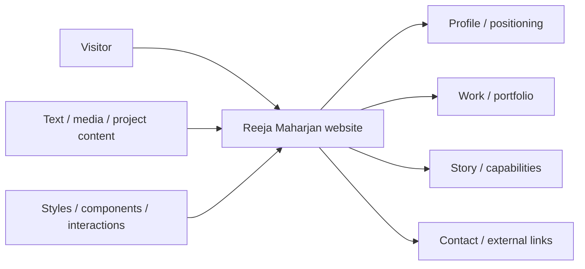
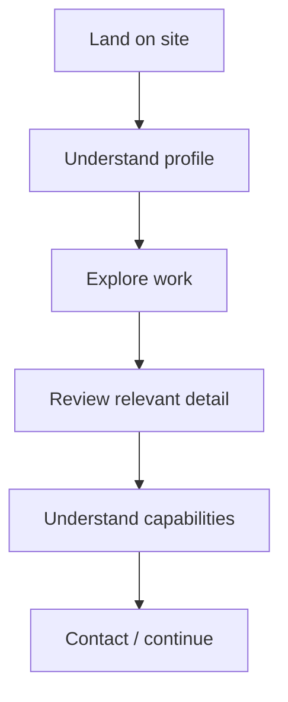
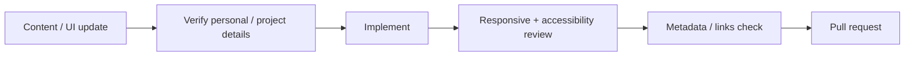

<div align="center">

# Reeja Maharjan Website 2026

**A 2026 personal website and portfolio project for presenting Reeja Maharjan's profile, work, story, and contact paths through a polished responsive experience.**


[Browse source](https://github.com/Nischhalsubba/Reeja-Maharjan-Website-2026/tree/main) · [Issues](https://github.com/Nischhalsubba/Reeja-Maharjan-Website-2026/issues)

</div>

## Overview

**Reeja Maharjan Website 2026** is documented as a personal brand / portfolio experience. The website should communicate who the person is, what work or capabilities are relevant, and how a visitor can continue exploring or make contact.

<details open>
<summary><strong>🏗️ Interactive website architecture</strong></summary>



</details>

## Visitor flow



## Audience guide

| Audience | Focus |
|---|---|
| Visitors | Profile, work and contact |
| Developers | Structure, components, assets and delivery |
| Designers | Storytelling, hierarchy, responsive behavior and accessibility |
| Content owner | Accurate biography, work, imagery, links and metadata |

## Getting started

```bash
git clone https://github.com/Nischhalsubba/Reeja-Maharjan-Website-2026.git
cd Reeja-Maharjan-Website-2026
```

Use the repository manifests and lockfiles to determine supported setup and development commands.

## Design & accessibility

Keep project and profile information readable, navigation predictable, focus visible, images meaningful, layouts responsive, and motion optional. Verify image rights and personal information before public release.

## SEO & discoverability

Use accurate personal-name, role, work, and portfolio terminology. Maintain unique titles/descriptions, semantic headings, descriptive links, meaningful alt text, canonical URLs, social metadata, and Person/CreativeWork structured data when appropriate.

## Contribution flow


