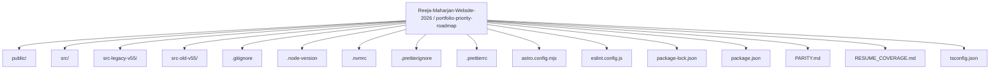
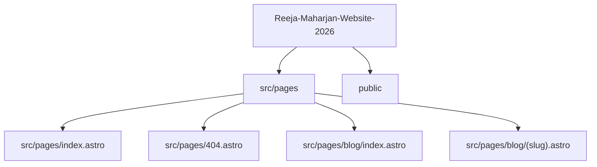
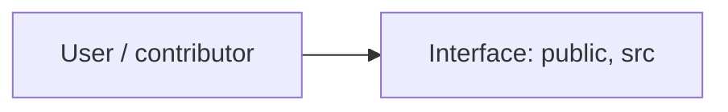
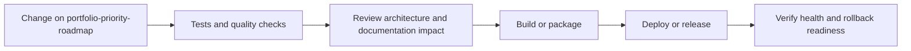
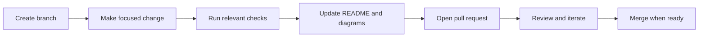

<!-- interactive-readme-standard:start -->

<div align="center">

# Reeja-Maharjan-Website-2026

**Branch-aware technical guide for [`portfolio-priority-roadmap`](https://github.com/Nischhalsubba/Reeja-Maharjan-Website-2026/tree/portfolio-priority-roadmap)**

<p>       </p>

<p>
  <a href="https://github.com/Nischhalsubba/Reeja-Maharjan-Website-2026/tree/portfolio-priority-roadmap"><strong>Browse source</strong></a> ·
  <a href="https://github.com/Nischhalsubba/Reeja-Maharjan-Website-2026/issues"><strong>Issues</strong></a> ·
  <a href="https://github.com/Nischhalsubba/Reeja-Maharjan-Website-2026/codespaces/new?ref=portfolio-priority-roadmap"><strong>Open in Codespaces</strong></a>
</p>

</div>

> [!IMPORTANT]
> This guide is generated from the files actually present on `portfolio-priority-roadmap`. It links to detected source paths, preserves project-authored notes, and avoids claiming components that were not found.

## At a glance

| Item | Detected value |
|---|---|
| Purpose | A web or interface project documented from the files currently present on this branch. |
| Branch role | Compared with `main` |
| Stack | React, Astro, Tailwind CSS, TypeScript, CSS, JavaScript |
| Manifests | package.json |
| Prerequisites | Node.js |
| Delivery | No conventional deployment configuration detected |
| License | No license file detected |

## Branch scope

This branch differs from the default branch in the following detected paths:

- [`README.md`](https://github.com/Nischhalsubba/Reeja-Maharjan-Website-2026/blob/portfolio-priority-roadmap/README.md)

## Quick start

```bash
npm install
npm run dev
npm run build
npm run lint
npm run preview
```

### Configuration surface

- No committed environment example file was detected.

> Never commit secrets, private keys, production credentials, customer data, or unredacted infrastructure details.

## Repository map



| Responsibility | Detected source paths |
|---|---|
| Interface | [`public`](https://github.com/Nischhalsubba/Reeja-Maharjan-Website-2026/tree/portfolio-priority-roadmap/public), [`src`](https://github.com/Nischhalsubba/Reeja-Maharjan-Website-2026/tree/portfolio-priority-roadmap/src) |

## Website or application map



## Architecture and responsibility flow




## Quality, security, and operations

<table>
<tr>
<td width="33%" valign="top">

### Quality

- No conventional test directory was detected automatically.

Detected commands:
- `npm run dev`
- `npm run build`
- `npm run lint`
- `npm run preview`
- `npm run format`

</td>
<td width="33%" valign="top">

### Security

- No dedicated security policy or automated dependency configuration was detected.

Review authentication, authorization, input validation, dependency updates, secret handling, and failure recovery before release.

</td>
<td width="34%" valign="top">

### Observability

- No dedicated observability integration was detected automatically.

Define useful logs, metrics, traces, alerts, and rollback signals for production-facing branches.

</td>
</tr>
</table>

## Delivery flow



### Automation detected

- No GitHub Actions workflow files were detected.

## Contribution flow



- Keep changes focused and explain architectural consequences.
- Run the checks relevant to the changed area.
- Update diagrams whenever routes, modules, data models, authentication, jobs, or delivery paths change.
- Add screenshots or recordings for visual behavior changes when useful.
- Use issues for reproducible defects and pull requests for reviewable changes.

## Ownership and support

| Topic | Source |
|---|---|
| Repository | [`Nischhalsubba/Reeja-Maharjan-Website-2026`](https://github.com/Nischhalsubba/Reeja-Maharjan-Website-2026) |
| Branch | [`portfolio-priority-roadmap`](https://github.com/Nischhalsubba/Reeja-Maharjan-Website-2026/tree/portfolio-priority-roadmap) |
| Ownership | No CODEOWNERS file detected |
| Contributing | Use the contribution flow above |
| Support | [Open or review issues](https://github.com/Nischhalsubba/Reeja-Maharjan-Website-2026/issues) |
| License | No license file detected |

<details>
<summary><strong>Documentation maintenance checklist</strong></summary>

- [ ] Purpose and branch scope are accurate.
- [ ] Setup and configuration commands still work.
- [ ] Repository, application, API, data, authentication, job, and deployment diagrams match the code.
- [ ] Tests, security controls, observability, and rollback behavior are documented.
- [ ] Links point to real files on this branch.
- [ ] No secrets or private operational details are exposed.

</details>

<!-- interactive-readme-standard:end -->

<!-- project-authored-notes:start -->
<details>
<summary><strong>Project-authored notes preserved from this branch</strong></summary>

# Reeja Maharjan Website 2026

> A static, SEO-focused professional nurse portfolio for **Reeja Maharjan**, built with Astro, Tailwind CSS, TypeScript, structured content, privacy-safe credential summaries, and recruiter-first UX.

## Phase 2 Deployment Checkpoint

This branch consolidates the recruiter-focused portfolio improvements into a buildable state for Cloudflare Pages preview deployment.

### Current branch focus

- Sharper hero positioning around NNC RN, Texas RN, NCLEX-RN, and hospital experience.
- Recruiter-first homepage order: profile, role fit, experience, credentials, strengths, education, recommendations, verification, blog, contact.
- Privacy-safe credential handling: sensitive license reports, transcripts, signatures, stamps, and full letters are not publicly exposed by default.
- Stronger experience scanning with tags, checklists, and private verification wording.
- Safer certification cards with public summaries and request-based proof language.

## Local Development

```bash
npm install
npm run dev
```

## Quality Commands

```bash
npm run check
npm run lint
npm run build
```

## Deployment

The project targets Cloudflare Pages as a static Astro site. Use the latest successful preview deployment for branch review before merging to `main`.

## Privacy Note

Do not upload unredacted license reports, transcripts, experience letters, certificates, signatures, stamps, addresses, or personal identifiers to the public site. Use public summaries and share full documents privately only when needed.

</details>
<!-- project-authored-notes:end -->
