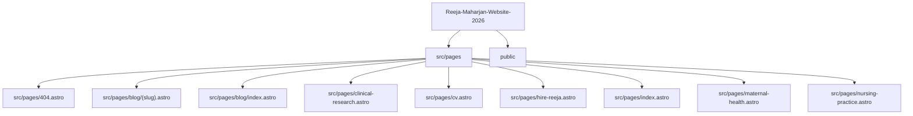
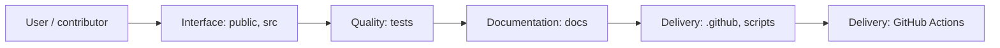
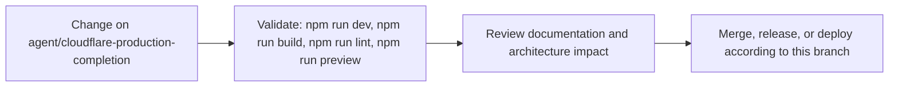

# Reeja Maharjan Website 2026

<!-- interactive-readme-standard:start -->

> [!NOTE]
> **Branch-specific documentation:** this section is maintained for [`agent/cloudflare-production-completion`](https://github.com/Nischhalsubba/Reeja-Maharjan-Website-2026/tree/agent/cloudflare-production-completion). It is generated from the files present on this branch and preserves the project-authored README below.

<details open>
<summary><strong>Interactive repository guide</strong></summary>

## Branch overview

| Item | Value |
|---|---|
| Repository | [`Nischhalsubba/Reeja-Maharjan-Website-2026`](https://github.com/Nischhalsubba/Reeja-Maharjan-Website-2026) |
| Branch | [`agent/cloudflare-production-completion`](https://github.com/Nischhalsubba/Reeja-Maharjan-Website-2026/tree/agent/cloudflare-production-completion) |
| Detected stack | Astro, Tailwind CSS, TypeScript, JavaScript, CSS |
| Detected manifests | package.json |
| Documentation policy | Every maintained branch must explain purpose, setup, structure, architecture, flows, testing, delivery, security, and ownership. |

## Repository structure

```mermaid
flowchart TD
    ROOT["Reeja-Maharjan-Website-2026 / agent/cloudflare-production-completion"]
    ROOT --> P0[".github/"]
    ROOT --> P1[".vscode/"]
    ROOT --> P2["docs/"]
    ROOT --> P3["public/"]
    ROOT --> P4["scripts/"]
    ROOT --> P5["src/"]
    ROOT --> P6["tests/"]
    ROOT --> P7[".gitignore"]
    ROOT --> P8[".node-version"]
    ROOT --> P9[".nvmrc"]
    ROOT --> P10[".prettierignore"]
    ROOT --> P11[".prettierrc"]
    ROOT --> P12["astro.config.mjs"]
    ROOT --> P13["eslint.config.js"]
    ROOT --> P14["package-lock.json"]
    ROOT --> P15["package.json"]
    ROOT --> P16["PARITY.md"]
    ROOT --> P17["RESUME_COVERAGE.md"]
    ROOT --> MORE["+ 1 more top-level entries"]
```



The diagram is generated from the branch's actual top-level files and directories. Use the branch link above for complete source navigation.

## Website or application structure



## Application and responsibility flow



## Change-to-delivery flow



## README requirements for this branch

- Explain what this branch contains and how it differs from the default branch.
- Keep installation, configuration, usage, testing, deployment, security, support, and license information accurate.
- Document repository, website or application, API, data, authentication, background-job, and deployment flows when they exist.
- Prefer Mermaid diagrams and expandable `<details>` sections for visual navigation.
- Link diagrams and modules to real source paths; never invent missing components.
- Preserve project-specific documentation and update diagrams whenever architecture or major paths change.
- Treat secrets, private infrastructure, customer data, and credentials as prohibited README content.

</details>

<!-- interactive-readme-standard:end -->

> A static, SEO-focused professional nurse portfolio for **Reeja Maharjan**, built with Astro, Tailwind CSS, TypeScript, structured content, privacy-safe credential summaries, and recruiter-first UX.

## Production Status

The production site deploys from `main` through Cloudflare Pages. Every production change should be treated as user-facing and must pass the GitHub **Build Check** workflow before being considered stable.

## Design Direction

This website should feel calm, trustworthy, clinically credible, and recruiter-ready. It should not feel like a generic creative portfolio, a hospital brochure, or a noisy animation demo. The first screen should answer three questions quickly:

1. Who is Reeja?
2. Why is she credible?
3. How can a recruiter contact her?

### Design Principles

- Lead with license status, clinical experience, and role fit.
- Keep sensitive documents private and summarize evidence publicly.
- Use restrained motion, clear hierarchy, and readable typography.
- Make the primary contact path obvious on desktop and mobile.
- Prefer fewer stronger sections over many repetitive sections.
- Avoid unsupported claims, fake metrics, decorative clutter, and vague calls to action.

## Current Site Focus

- Sharper hero positioning around NNC RN, Texas RN, NCLEX-RN, and hospital experience.
- Recruiter-first homepage order: profile, role fit, experience, credentials, strengths, education, recommendations, verification, blog, contact.
- Privacy-safe credential handling: sensitive reports, transcripts, signatures, stamps, and full letters are not publicly exposed by default.
- Stronger experience scanning with tags, checklists, and private verification wording.
- Safer certification cards with public summaries and request-based proof language.
- Blog pages include author credibility, review notes, FAQ schema, and safety language.

## Local Development

```bash
npm install
npm run dev
```

## Quality Commands

```bash
npm run check
npm run lint
npm run build
```

## Safe Deployment Workflow

Use this workflow for future changes:

1. Make small, reviewable commits.
2. Avoid changing dependencies and UI layout in the same commit.
3. For dependency/config changes, wait for GitHub **Build Check** before making more changes.
4. Confirm Cloudflare production deployment is green after each main push.
5. If a deployment fails, inspect logs before pushing another fix.

## Manual Branch Protection Recommendation

In GitHub settings, protect `main` and require the **Build Check** workflow before merging. This prevents broken dependency/config changes from going directly into production. The workflow exists in `.github/workflows/build-check.yml`, but branch protection must be enabled manually in GitHub.

## Privacy Note

Do not upload unredacted license reports, transcripts, experience letters, certificates, signatures, stamps, addresses, or personal identifiers to the public site. Use public summaries and share full documents privately only when needed.

## Remaining Product Backlog

- Replace or recreate the downloadable PDF CV so it matches the updated website positioning.
- Continue improving the credentials section visually, while keeping sensitive verification documents private.
- Run manual mobile QA on real devices.
- Test social previews on LinkedIn, WhatsApp, Facebook, and X/Twitter.
- Keep dependency changes isolated and verified before additional production changes.
