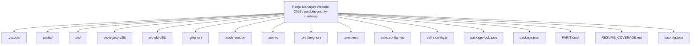
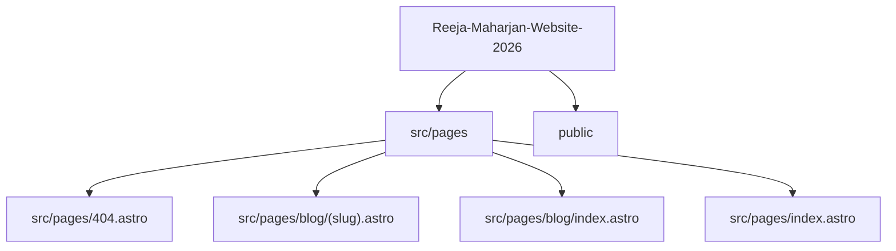
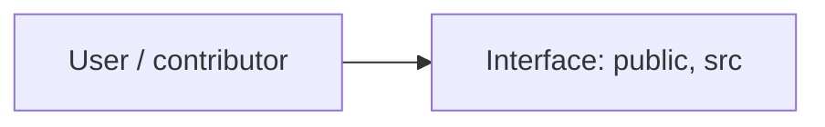
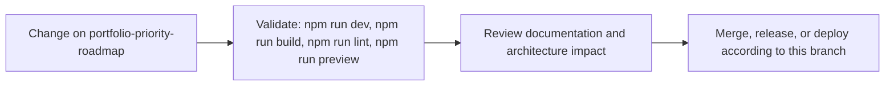

# Reeja Maharjan Website 2026

<!-- interactive-readme-standard:start -->

> [!NOTE]
> **Branch-specific documentation:** this section is maintained for [`portfolio-priority-roadmap`](https://github.com/Nischhalsubba/Reeja-Maharjan-Website-2026/tree/portfolio-priority-roadmap). It is generated from the files present on this branch and preserves the project-authored README below.

<details open>
<summary><strong>Interactive repository guide</strong></summary>

## Branch overview

| Item | Value |
|---|---|
| Repository | [`Nischhalsubba/Reeja-Maharjan-Website-2026`](https://github.com/Nischhalsubba/Reeja-Maharjan-Website-2026) |
| Branch | [`portfolio-priority-roadmap`](https://github.com/Nischhalsubba/Reeja-Maharjan-Website-2026/tree/portfolio-priority-roadmap) |
| Detected stack | React, Astro, Tailwind CSS, TypeScript, CSS, JavaScript |
| Detected manifests | package.json |
| Documentation policy | Every maintained branch must explain purpose, setup, structure, architecture, flows, testing, delivery, security, and ownership. |

## Repository structure



The diagram is generated from the branch's actual top-level files and directories. Use the branch link above for complete source navigation.

## Website or application structure



## Application and responsibility flow



## Change-to-delivery flow



## README requirements for this branch

- Explain what this branch contains and how it differs from the default branch.
- Keep installation, configuration, usage, testing, deployment, security, support, and license information accurate.
- Document repository, website or application, API, data, authentication, background-job, and deployment flows when they exist.
- Prefer Mermaid diagrams and expandable `<details>` sections for visual navigation.
- Link diagrams and modules to real source paths; never invent missing components.
- Preserve project-specific documentation and update diagrams whenever architecture or major paths change.
- Treat secrets, private infrastructure, customer data, and credentials as prohibited README content.

</details>

<!-- interactive-readme-standard:end -->

> A static, SEO-focused professional nurse portfolio for **Reeja Maharjan**, built with Astro, Tailwind CSS, TypeScript, structured content, privacy-safe credential summaries, and recruiter-first UX.

## Phase 2 Deployment Checkpoint

This branch consolidates the recruiter-focused portfolio improvements into a buildable state for Cloudflare Pages preview deployment.

### Current branch focus

- Sharper hero positioning around NNC RN, Texas RN, NCLEX-RN, and hospital experience.
- Recruiter-first homepage order: profile, role fit, experience, credentials, strengths, education, recommendations, verification, blog, contact.
- Privacy-safe credential handling: sensitive license reports, transcripts, signatures, stamps, and full letters are not publicly exposed by default.
- Stronger experience scanning with tags, checklists, and private verification wording.
- Safer certification cards with public summaries and request-based proof language.

## Local Development

```bash
npm install
npm run dev
```

## Quality Commands

```bash
npm run check
npm run lint
npm run build
```

## Deployment

The project targets Cloudflare Pages as a static Astro site. Use the latest successful preview deployment for branch review before merging to `main`.

## Privacy Note

Do not upload unredacted license reports, transcripts, experience letters, certificates, signatures, stamps, addresses, or personal identifiers to the public site. Use public summaries and share full documents privately only when needed.
