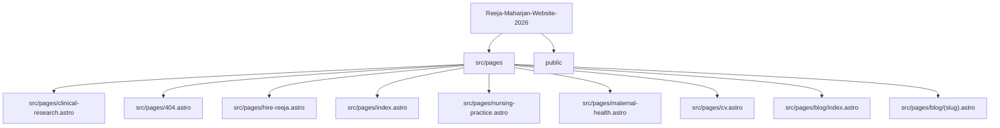
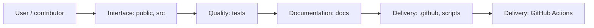
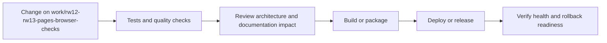
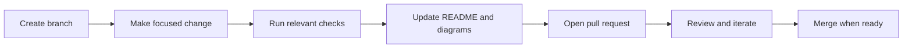

<!-- interactive-readme-standard:start -->

<div align="center">

# Reeja-Maharjan-Website-2026

**Branch-aware technical guide for [`work/rw12-rw13-pages-browser-checks`](https://github.com/Nischhalsubba/Reeja-Maharjan-Website-2026/tree/work/rw12-rw13-pages-browser-checks)**

<p>      </p>

<p>
  <a href="https://github.com/Nischhalsubba/Reeja-Maharjan-Website-2026/tree/work/rw12-rw13-pages-browser-checks"><strong>Browse source</strong></a> ·
  <a href="https://github.com/Nischhalsubba/Reeja-Maharjan-Website-2026/issues"><strong>Issues</strong></a> ·
  <a href="https://github.com/Nischhalsubba/Reeja-Maharjan-Website-2026/codespaces/new?ref=work%2Frw12-rw13-pages-browser-checks"><strong>Open in Codespaces</strong></a>
</p>

</div>

> [!IMPORTANT]
> This guide is generated from the files actually present on `work/rw12-rw13-pages-browser-checks`. It links to detected source paths, preserves project-authored notes, and avoids claiming components that were not found.

## At a glance

| Item | Detected value |
|---|---|
| Purpose | An Astro, Tailwind CSS, and TypeScript professional nurse portfolio for Reeja Maharjan with recruiter-first homepage architecture, privacy-safe credential summaries, structured Person metadata, blog credibility notes, Cloudflare Pages deployment, and Build Check workflow support. |
| Branch role | Compared with `main` |
| Stack | Astro, Tailwind CSS, TypeScript, CSS, JavaScript |
| Manifests | package.json |
| Prerequisites | Node.js |
| Delivery | GitHub Actions |
| License | No license file detected |

## Branch scope

This branch differs from the default branch in the following detected paths:

- [`README.md`](https://github.com/Nischhalsubba/Reeja-Maharjan-Website-2026/blob/work/rw12-rw13-pages-browser-checks/README.md)

## Quick start

```bash
npm install
npm run dev
npm run build
npm run lint
npm run preview
```

### Configuration surface

- No committed environment example file was detected.

> Never commit secrets, private keys, production credentials, customer data, or unredacted infrastructure details.

## Repository map

```mermaid
flowchart TD
    ROOT["Reeja-Maharjan-Website-2026 / work/rw12-rw13-pages-browser-checks"]
    ROOT --> P0[".github/"]
    ROOT --> P1["docs/"]
    ROOT --> P2["public/"]
    ROOT --> P3["scripts/"]
    ROOT --> P4["src/"]
    ROOT --> P5["src-legacy-v55/"]
    ROOT --> P6["src-old-v55/"]
    ROOT --> P7["tests/"]
    ROOT --> P8[".gitignore"]
    ROOT --> P9[".node-version"]
    ROOT --> P10[".nvmrc"]
    ROOT --> P11[".prettierignore"]
    ROOT --> P12[".prettierrc"]
    ROOT --> P13["astro.config.mjs"]
    ROOT --> P14["eslint.config.js"]
    ROOT --> P15["package-lock.json"]
    ROOT --> P16["package.json"]
    ROOT --> P17["PARITY.md"]
    ROOT --> MORE["+ 2 more top-level entries"]
```



| Responsibility | Detected source paths |
|---|---|
| Interface | [`public`](https://github.com/Nischhalsubba/Reeja-Maharjan-Website-2026/tree/work/rw12-rw13-pages-browser-checks/public), [`src`](https://github.com/Nischhalsubba/Reeja-Maharjan-Website-2026/tree/work/rw12-rw13-pages-browser-checks/src) |
| Quality | [`tests`](https://github.com/Nischhalsubba/Reeja-Maharjan-Website-2026/tree/work/rw12-rw13-pages-browser-checks/tests) |
| Documentation | [`docs`](https://github.com/Nischhalsubba/Reeja-Maharjan-Website-2026/tree/work/rw12-rw13-pages-browser-checks/docs) |
| Delivery | [`.github`](https://github.com/Nischhalsubba/Reeja-Maharjan-Website-2026/tree/work/rw12-rw13-pages-browser-checks/.github), [`scripts`](https://github.com/Nischhalsubba/Reeja-Maharjan-Website-2026/tree/work/rw12-rw13-pages-browser-checks/scripts) |

## Website or application map



## Architecture and responsibility flow




## Quality, security, and operations

<table>
<tr>
<td width="33%" valign="top">

### Quality

- [`tests`](https://github.com/Nischhalsubba/Reeja-Maharjan-Website-2026/tree/work/rw12-rw13-pages-browser-checks/tests)

Detected commands:
- `npm run dev`
- `npm run build`
- `npm run lint`
- `npm run preview`
- `npm run format`

</td>
<td width="33%" valign="top">

### Security

- No dedicated security policy or automated dependency configuration was detected.

Review authentication, authorization, input validation, dependency updates, secret handling, and failure recovery before release.

</td>
<td width="34%" valign="top">

### Observability

- No dedicated observability integration was detected automatically.

Define useful logs, metrics, traces, alerts, and rollback signals for production-facing branches.

</td>
</tr>
</table>

## Delivery flow



### Automation detected

- [`.github/workflows/browser-quality.yml`](https://github.com/Nischhalsubba/Reeja-Maharjan-Website-2026/blob/work/rw12-rw13-pages-browser-checks/.github/workflows/browser-quality.yml)
- [`.github/workflows/build-check.yml`](https://github.com/Nischhalsubba/Reeja-Maharjan-Website-2026/blob/work/rw12-rw13-pages-browser-checks/.github/workflows/build-check.yml)
- [`.github/workflows/production-diagnostics.yml`](https://github.com/Nischhalsubba/Reeja-Maharjan-Website-2026/blob/work/rw12-rw13-pages-browser-checks/.github/workflows/production-diagnostics.yml)
- [`.github/workflows/production-smoke.yml`](https://github.com/Nischhalsubba/Reeja-Maharjan-Website-2026/blob/work/rw12-rw13-pages-browser-checks/.github/workflows/production-smoke.yml)

## Contribution flow



- Keep changes focused and explain architectural consequences.
- Run the checks relevant to the changed area.
- Update diagrams whenever routes, modules, data models, authentication, jobs, or delivery paths change.
- Add screenshots or recordings for visual behavior changes when useful.
- Use issues for reproducible defects and pull requests for reviewable changes.

## Ownership and support

| Topic | Source |
|---|---|
| Repository | [`Nischhalsubba/Reeja-Maharjan-Website-2026`](https://github.com/Nischhalsubba/Reeja-Maharjan-Website-2026) |
| Branch | [`work/rw12-rw13-pages-browser-checks`](https://github.com/Nischhalsubba/Reeja-Maharjan-Website-2026/tree/work/rw12-rw13-pages-browser-checks) |
| Ownership | No CODEOWNERS file detected |
| Contributing | Use the contribution flow above |
| Support | [Open or review issues](https://github.com/Nischhalsubba/Reeja-Maharjan-Website-2026/issues) |
| License | No license file detected |

<details>
<summary><strong>Documentation maintenance checklist</strong></summary>

- [ ] Purpose and branch scope are accurate.
- [ ] Setup and configuration commands still work.
- [ ] Repository, application, API, data, authentication, job, and deployment diagrams match the code.
- [ ] Tests, security controls, observability, and rollback behavior are documented.
- [ ] Links point to real files on this branch.
- [ ] No secrets or private operational details are exposed.

</details>

<!-- interactive-readme-standard:end -->

<!-- project-authored-notes:start -->
<details>
<summary><strong>Project-authored notes preserved from this branch</strong></summary>

# Reeja Maharjan Website 2026

> A static, SEO-focused professional nurse portfolio for **Reeja Maharjan**, built with Astro, Tailwind CSS, TypeScript, structured content, privacy-safe credential summaries, and recruiter-first UX.

## Production Status

The production site deploys from `main` through Cloudflare Pages. Every production change should be treated as user-facing and must pass the GitHub **Build Check** workflow before being considered stable.

## Design Direction

This website should feel calm, trustworthy, clinically credible, and recruiter-ready. It should not feel like a generic creative portfolio, a hospital brochure, or a noisy animation demo. The first screen should answer three questions quickly:

1. Who is Reeja?
2. Why is she credible?
3. How can a recruiter contact her?

### Design Principles

- Lead with license status, clinical experience, and role fit.
- Keep sensitive documents private and summarize evidence publicly.
- Use restrained motion, clear hierarchy, and readable typography.
- Make the primary contact path obvious on desktop and mobile.
- Prefer fewer stronger sections over many repetitive sections.
- Avoid unsupported claims, fake metrics, decorative clutter, and vague calls to action.

## Current Site Focus

- Sharper hero positioning around NNC RN, Texas RN, NCLEX-RN, and hospital experience.
- Recruiter-first homepage order: profile, role fit, experience, credentials, strengths, education, recommendations, verification, blog, contact.
- Privacy-safe credential handling: sensitive reports, transcripts, signatures, stamps, and full letters are not publicly exposed by default.
- Stronger experience scanning with tags, checklists, and private verification wording.
- Safer certification cards with public summaries and request-based proof language.
- Blog pages include author credibility, review notes, FAQ schema, and safety language.

## Local Development

```bash
npm install
npm run dev
```

## Quality Commands

```bash
npm run check
npm run lint
npm run build
```

## Safe Deployment Workflow

Use this workflow for future changes:

1. Make small, reviewable commits.
2. Avoid changing dependencies and UI layout in the same commit.
3. For dependency/config changes, wait for GitHub **Build Check** before making more changes.
4. Confirm Cloudflare production deployment is green after each main push.
5. If a deployment fails, inspect logs before pushing another fix.

## Manual Branch Protection Recommendation

In GitHub settings, protect `main` and require the **Build Check** workflow before merging. This prevents broken dependency/config changes from going directly into production. The workflow exists in `.github/workflows/build-check.yml`, but branch protection must be enabled manually in GitHub.

## Privacy Note

Do not upload unredacted license reports, transcripts, experience letters, certificates, signatures, stamps, addresses, or personal identifiers to the public site. Use public summaries and share full documents privately only when needed.

## Remaining Product Backlog

- Replace or recreate the downloadable PDF CV so it matches the updated website positioning.
- Continue improving the credentials section visually, while keeping sensitive verification documents private.
- Run manual mobile QA on real devices.
- Test social previews on LinkedIn, WhatsApp, Facebook, and X/Twitter.
- Keep dependency changes isolated and verified before additional production changes.

</details>
<!-- project-authored-notes:end -->
