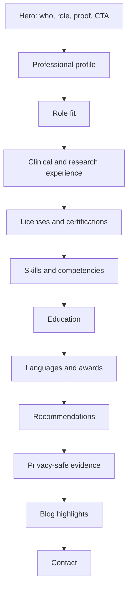

# Reeja Maharjan Website 2026 — Product and Engineering Case Study

> A comprehensive product, UX, privacy, SEO, architecture, deployment, and maintenance case study for the Reeja Maharjan professional nurse portfolio. This document is intentionally detailed so recruiters, maintainers, portfolio reviewers, future collaborators, and AI coding agents can understand the site without treating a healthcare portfolio like a decorative landing page with a stethoscope emoji taped to it.

## Table of Contents

1. [Executive Summary](#executive-summary)
2. [Repository Snapshot](#repository-snapshot)
3. [Product Context](#product-context)
4. [Problem Statement](#problem-statement)
5. [Primary Audience](#primary-audience)
6. [Core Product Promise](#core-product-promise)
7. [Recruiter-First Information Architecture](#recruiter-first-information-architecture)
8. [Privacy-Safe Credential Strategy](#privacy-safe-credential-strategy)
9. [Homepage Section Strategy](#homepage-section-strategy)
10. [Content Model](#content-model)
11. [Clinical Credibility Strategy](#clinical-credibility-strategy)
12. [SEO and Structured Data Strategy](#seo-and-structured-data-strategy)
13. [Blog and Health-Content Safety](#blog-and-health-content-safety)
14. [Visual Design Direction](#visual-design-direction)
15. [Accessibility Strategy](#accessibility-strategy)
16. [Astro Architecture](#astro-architecture)
17. [Component Architecture](#component-architecture)
18. [Styling and Token Strategy](#styling-and-token-strategy)
19. [Performance Strategy](#performance-strategy)
20. [Security and Privacy Notes](#security-and-privacy-notes)
21. [Deployment and Build Safety](#deployment-and-build-safety)
22. [Quality Workflow](#quality-workflow)
23. [Risk Register](#risk-register)
24. [Maintenance Playbook](#maintenance-playbook)
25. [Roadmap](#roadmap)
26. [Portfolio Review Notes](#portfolio-review-notes)
27. [AI Coding Agent Notes](#ai-coding-agent-notes)
28. [Appendix A: Suggested Content Contract](#appendix-a-suggested-content-contract)
29. [Appendix B: Manual QA Matrix](#appendix-b-manual-qa-matrix)
30. [Appendix C: Privacy Redaction Checklist](#appendix-c-privacy-redaction-checklist)
31. [Appendix D: Suggested AGENTS.md](#appendix-d-suggested-agentsmd)
32. [Appendix E: Glossary](#appendix-e-glossary)
33. [Disclaimer](#disclaimer)

---

## Executive Summary

**Reeja Maharjan Website 2026** is a static, SEO-focused, recruiter-first professional nurse portfolio for Reeja Maharjan. It is built with Astro, Tailwind CSS, TypeScript, structured profile content, clinical credibility sections, privacy-safe credential summaries, blog pages, structured metadata, and Cloudflare Pages deployment.

The website is not a generic creative portfolio. Its purpose is sharper and more sensitive:

> Present Reeja's nursing license status, current research role, hospital experience, maternal-health relevance, clinical competencies, education, recommendations, and contact path in a trustworthy public format without exposing sensitive documents or personal identifiers.

The current homepage architecture is deliberately ordered for recruiter scanning:

1. hero positioning
2. profile summary
3. role fit
4. experience
5. certifications
6. skills
7. education
8. languages
9. awards
10. recommendations
11. evidence/verification summary
12. blog highlights
13. contact

This case study documents the product reasoning, privacy boundaries, content model, SEO strategy, clinical credibility pattern, Astro architecture, deployment workflow, quality gates, risks, and maintenance rules required to keep the portfolio professional, safe, and useful.

---

## Repository Snapshot

| Attribute | Value |
|---|---|
| Repository | `Nischhalsubba/Reeja-Maharjan-Website-2026` |
| Product type | Professional nurse portfolio |
| Primary audience | recruiters, hospitals, research teams, NGO/INGO health programs |
| Framework | Astro `5.17.1` |
| Styling | Tailwind CSS `4.2.0` plus custom CSS tokens/components |
| Language | TypeScript |
| Motion | GSAP and SplitType, used cautiously |
| Deployment | Cloudflare Pages from `main` |
| Quality workflow | GitHub Actions Build Check |
| Main page | `src/pages/index.astro` |
| Main content source | `src/content/profile.ts` |
| Layout | `src/layouts/BaseLayout.astro` |
| Privacy model | public summaries, private proof on request |

---

## Product Context

Healthcare portfolios are not the same as design portfolios, personal blogs, or marketing pages. A nurse portfolio must build trust quickly, but it must also avoid reckless exposure of documents, credentials, signatures, addresses, license reports, and identity details.

Recruiters usually need to answer a few questions fast:

- Is this candidate licensed?
- What kind of nursing or research role fits her?
- What experience does she have?
- Is the information credible?
- Can I contact her easily?
- Are sensitive credentials handled responsibly?

The site is built around those questions. It prioritizes license status, current role, verified clinical experience, role fit, privacy-safe credential summaries, and contact clarity.

The design direction is calm, clinical, recruiter-ready, and restrained. It should not look like a noisy animation experiment. Healthcare credibility does not improve because text flew in sideways. Amazing, yet true.

---

## Problem Statement

### User problem

Recruiters and healthcare teams need a fast, credible summary of Reeja's nursing qualifications, current research role, hospital experience, and contact path.

### Candidate problem

Reeja needs to present strong evidence of credibility without exposing sensitive documents publicly.

### Product problem

The site must balance clarity, privacy, professionalism, SEO, and trust. Too little evidence feels vague. Too much evidence creates privacy risk.

### Engineering problem

The portfolio needs a maintainable Astro architecture, structured content source, predictable deployment workflow, and quality checks so production changes do not break the public site.

### Content safety problem

Health-related blog content and credential claims must avoid unsupported medical advice, exaggerated experience claims, and privacy-compromising proof files.

---

## Primary Audience

### 1. Hospital recruiters

Need to scan license status, role fit, hospital experience, education, and contact details.

### 2. Research coordinators

Need to understand MOM-HD, telemonitoring, BP/BG monitoring, REDCap-style data quality, participant education, and ethical communication experience.

### 3. NGO/INGO health program teams

Need evidence of communication, documentation, participant follow-up, maternal health exposure, and field/program readiness.

### 4. International nursing reviewers

Need Texas RN/NCLEX-related credibility and concise professional positioning.

### 5. Professional contacts

Need a simple path to verify credentials privately, view resume, and reach out.

---

## Core Product Promise

The website promises to be:

1. **Credible**
   - Lead with license status, current role, and clinical/research evidence.

2. **Recruiter-first**
   - Put the most decision-relevant information early.

3. **Privacy-safe**
   - Summarize credentials publicly; share full proof privately when needed.

4. **Clinically calm**
   - Use trustworthy design, not flashy decoration.

5. **Evidence-based**
   - Avoid unsupported claims and fake metrics.

6. **Maintainable**
   - Keep profile content structured and easy to update.

7. **Production-safe**
   - Use checks and Cloudflare deployment discipline.

---

## Recruiter-First Information Architecture

The homepage follows a deliberate recruiter-scanning order.



### Why this order works

The first screen answers:

1. Who is Reeja?
2. Why is she credible?
3. How can a recruiter contact her?

The middle sections build evidence. The later sections support verification, blog credibility, and contact conversion.

### IA rule

Do not bury license status, current role, or contact below decorative sections. Recruiters do not need a scavenger hunt. They already have inboxes, the cruelest UX ever invented.

---

## Privacy-Safe Credential Strategy

This is one of the most important parts of the site.

### Publicly safe

- credential titles
- issuing bodies
- summarized verification status
- broad experience descriptions
- public professional links
- redacted previews where appropriate
- request-based proof language

### Not safe by default

- full license reports
- transcripts
- unredacted certificates
- signatures
- stamps
- addresses
- ID numbers
- full recommendation letters with sensitive metadata
- private phone/address details beyond intended public contact

### Public proof pattern

Each credential section should answer:

- what the credential is
- why it matters
- who issued it
- what can be verified privately
- what is intentionally not public

### Rule

A public portfolio should prove credibility without turning identity documents into downloadable souvenirs for strangers. Humanity has enough problems without making doxxing easier.

---

## Homepage Section Strategy

### Hero

Purpose: establish role, credibility, and next action.

Must include:

- name
- role
- license highlights
- current research role
- proof chips
- primary contact CTA
- credential CTA

### Profile

Purpose: concise professional summary.

Should explain:

- license status
- clinical background
- research role
- maternal health relevance
- data/documentation strengths

### Role Fit

Purpose: help recruiters match Reeja to opportunities.

Strong categories:

- maternal health research assistant
- hospital staff nurse
- maternal/newborn care support
- NGO/INGO health program support
- international nursing readiness

### Experience

Purpose: show actual work history and responsibility scope.

Should avoid inflated language. Healthcare recruiters notice vague grandeur. Sadly, so do bots.

### Certifications

Purpose: show verified credibility without oversharing documents.

### Evidence

Purpose: explain what proof exists and how it can be shared privately.

### Contact

Purpose: make recruiter outreach simple.

---

## Content Model

The main structured content lives in `src/content/profile.ts`.

### Content strengths

- typed profile content
- structured hero data
- role-fit items
- experience items
- education items
- certification items
- skills groups
- recommendations
- evidence entries
- contact data

### Why typed content matters

Typed content reduces accidental shape changes. It also makes future section updates easier because maintainers can edit profile data without rewriting every component.

### Content model rule

If a section is driven by profile data, update the content source first. Avoid hardcoding duplicate professional claims in multiple components. Duplicate claims are how portfolios become inconsistent little legal liabilities.

---

## Clinical Credibility Strategy

The site should establish credibility through specific, verifiable signals.

### Credibility signals

- NNC Licensed RN
- Texas RN active status
- NCLEX-RN cleared
- current IISH MOM-HD research role
- hospital experience
- maternal/newborn care exposure
- BP/BG telemonitoring
- REDCap-style data quality
- participant education
- ethical communication

### Wording rules

- use precise role titles
- avoid unsupported claims
- avoid exaggerated metrics
- avoid pretending private proof is public
- keep medical claims within professional experience context

### Trust rule

Credibility should come from concrete evidence, not adjectives. “Highly dedicated, passionate, hardworking” is nice, but it does not beat a clear license, role, and responsibility summary.

---

## SEO and Structured Data Strategy

The base layout includes canonical URLs, Open Graph metadata, Twitter cards, robots index/follow, and Person JSON-LD.

### SEO goals

- rank for Reeja Maharjan professional profile searches
- make recruiter previews strong on LinkedIn and messaging apps
- surface nursing/research role positioning
- support blog discoverability where safe

### Metadata priorities

- title includes name and role
- description summarizes role and credibility
- social image is professional
- Person schema is accurate
- canonical URLs are stable

### SEO caution

Do not stuff keywords such as nurse, RN, NCLEX, Texas RN, Nepal, maternal health, research assistant, and GDM/HDP unnaturally. Search engines and humans both dislike desperation with commas.

---

## Blog and Health-Content Safety

Health-related blog content must be handled carefully.

### Blog should do

- explain health topics in accessible language
- cite or review medically appropriate sources where possible
- include review notes
- avoid overpromising
- include safety language
- encourage professional consultation for medical decisions

### Blog should not do

- diagnose readers
- replace medical consultation
- give unsafe treatment instructions
- exaggerate authority
- expose patient or participant stories without consent
- imply official institutional statements without authorization

### Safety rule

A nurse portfolio blog can demonstrate communication skill, but it should not become a medical advice engine. We have enough of those causing chaos in comment sections.

---

## Visual Design Direction

The intended visual tone is:

- calm
- clinical
- trustworthy
- recruiter-ready
- readable
- restrained
- modern but not flashy

### Design elements

- soft clinical palette
- strong typography hierarchy
- generous spacing
- card-based evidence sections
- clear CTA hierarchy
- accessible focus states
- restrained motion

### Avoid

- decorative clutter
- fake hospital branding
- excessive animations
- unsupported credibility badges
- noisy gradients
- tiny text
- vague call-to-action buttons

---

## Accessibility Strategy

### Core requirements

- semantic section headings
- keyboard-accessible navigation
- clear focus-visible states
- readable contrast
- descriptive image alt text
- large enough tap targets
- reduced-motion support where animation exists
- accessible contact links
- readable mobile layout

### High-risk areas

- image lightbox
- mobile nav
- credential preview cards
- contact section
- blog pages
- animated hero text if used

### Accessibility principle

A healthcare portfolio should feel easy to read for everyone. If a recruiter has to pinch-zoom a license summary, the design has failed in a very boring and very fixable way.

---

## Astro Architecture

The app uses Astro for static rendering.

### Key files

| Path | Purpose |
|---|---|
| `src/pages/index.astro` | homepage composition |
| `src/layouts/BaseLayout.astro` | global layout, metadata, schema, styles, header/footer |
| `src/content/profile.ts` | structured professional content |
| `src/components/*.astro` | section components |
| `src/styles/*.css` | tokens, base, layout, components, pages |
| `.github/workflows/build-check.yml` | CI build check |

### Homepage composition

The homepage imports section components and passes structured profile content into them. This is good because the page remains readable and section order is explicit.

### Architecture rule

Keep homepage section order intentional. Do not add sections because “more content feels impressive.” Recruiter UX rewards clarity, not section hoarding.

---

## Component Architecture

### Section components

Current homepage sections include:

- Hero
- ProfileSection
- RoleFitSection
- ExperienceSection
- CertificationsSection
- SkillsSection
- EducationSection
- LanguagesSection
- AwardsSection
- RecommendationsSection
- EvidenceSection
- BlogHighlightsSection
- ContactSection
- ImageLightbox

### Component rules

- components should consume typed profile data
- section intros should remain consistent
- credential previews should avoid exposing sensitive files
- repeated card patterns should share styling conventions
- contact CTAs should remain obvious

### Component risk

Hardcoding duplicate claims inside components can make content drift from `profile.ts`. Keep professional claims centralized where possible.

---

## Styling and Token Strategy

The layout imports:

- `tokens.css`
- `base.css`
- `layout.css`
- `components.css`
- `pages.css`

The base layout also includes global clinical styling overrides.

### Styling goals

- consistent clinical palette
- readable cards
- good spacing
- strong CTAs
- accessible focus states
- simple motion and hover behavior

### Styling rules

- prefer tokens over one-off values
- keep contact buttons prominent
- avoid low-contrast clinical colors
- test mobile sections after any CSS change
- do not scatter critical layout rules across too many files without comments

---

## Performance Strategy

Astro gives the site a strong static baseline.

### Performance priorities

- optimized images
- limited JavaScript
- careful GSAP/SplitType use
- fast hero render
- clean CSS
- no unnecessary client hydration
- good social preview image size

### Performance risks

| Risk | Why it matters | Mitigation |
|---|---|---|
| large images | slower portfolio load | compress and size correctly |
| excessive animation | clinical trust and performance harm | keep motion restrained |
| too many global styles | CSS bloat | audit and consolidate |
| blog media | slow content pages | optimize images |
| external fonts | render delay | preconnect and sensible font use |

---

## Security and Privacy Notes

### Do not publish

- unredacted license files
- transcripts
- signatures
- stamps
- private addresses
- private IDs
- full recommendation letters without consent
- sensitive certificate metadata

### Contact data caution

Public email/phone/WhatsApp links can invite spam. Use only contact information intended for public recruiter access.

### Repository caution

Public repositories can expose files even if they are not linked from the UI. Do not commit sensitive documents to the repo and assume “not linked” means private. That is not privacy. That is hide-and-seek with a search index.

---

## Deployment and Build Safety

The README states production deploys from `main` through Cloudflare Pages and should pass GitHub Build Check.

### Build Check workflow

The GitHub workflow:

- runs on pull requests
- runs on push to `main`
- uses Node 22
- installs dependencies
- runs `npm run check`
- runs `npm run build`

### Deployment rule

Every production change is user-facing. Treat main branch changes as public updates, not casual experiments.

### Branch protection recommendation

Require Build Check before merging into `main`.

---

## Quality Workflow

### Local commands

```bash
npm install
npm run dev
npm run check
npm run lint
npm run build
npm run verify
```

### Recommended pre-push flow

1. Edit content or components.
2. Run `npm run check`.
3. Run `npm run lint`.
4. Run `npm run build`.
5. Manually check key pages.
6. Push only after verification.

### Manual checks

- homepage desktop
- homepage mobile
- contact links
- credential privacy language
- social preview metadata
- blog pages
- image lightbox
- navigation
- Cloudflare deployment status

---

## Risk Register

| Risk | Severity | Why it matters | Mitigation |
|---|---:|---|---|
| sensitive documents committed | High | privacy and identity risk | never commit unredacted proof files |
| unsupported clinical claims | High | credibility/legal risk | keep claims evidence-based |
| broken production deploy | Medium | public portfolio downtime | Build Check and branch protection |
| poor mobile CTA | Medium | recruiters cannot contact easily | real-device QA |
| stale license information | High | credibility risk | review profile content regularly |
| social previews broken | Low/Medium | weaker sharing impression | test LinkedIn/WhatsApp previews |
| animation too flashy | Medium | harms clinical trust | restrained motion |
| duplicate content claims | Medium | inconsistent portfolio | centralize in profile content |
| blog medical advice overreach | High | safety risk | safety language and review notes |
| exposed phone/email spam | Low/Medium | nuisance/security | only publish intended contact paths |

---

## Maintenance Playbook

### Updating profile content

1. Edit `src/content/profile.ts`.
2. Keep claims precise and evidence-based.
3. Avoid adding sensitive document URLs.
4. Run `npm run check`.
5. Run `npm run build`.
6. Check homepage sections manually.

### Updating credentials

1. Add public summary only.
2. Avoid unredacted proof files.
3. Use request-based proof wording.
4. Update certification/evidence sections.
5. Verify no private data appears in public HTML.

### Updating design

1. Check tokens and shared CSS first.
2. Keep clinical tone restrained.
3. Test mobile layout.
4. Check focus states.
5. Confirm contact CTA remains obvious.

### Updating dependencies

1. Isolate dependency changes.
2. Run local verify.
3. Wait for Build Check.
4. Confirm Cloudflare production deployment.
5. Avoid mixing dependency updates with layout rewrites.

---

## Roadmap

### Near term

- Recreate downloadable PDF CV to match updated positioning.
- Improve credential section visual hierarchy.
- Add or verify deployment notes if needed.
- Test social previews.
- Complete real-device mobile QA.

### Mid term

- Add a privacy-safe credential request workflow.
- Add clearer blog review notes.
- Add changelog for professional profile updates.
- Add recruiter-specific downloadable summary.
- Add manual branch protection.

### Long term

- Add multilingual or Nepali-friendly health education content if reviewed.
- Add structured case examples without patient identifiers.
- Add content review workflow for medical posts.
- Add analytics only if privacy-safe and disclosed.

---

## Portfolio Review Notes

This project demonstrates:

- healthcare portfolio product strategy
- privacy-aware credential design
- recruiter-first UX
- Astro component architecture
- structured content modeling
- clinical credibility writing
- SEO and structured data
- deployment safety

### Strong summary

> Built an Astro-based professional nurse portfolio for Reeja Maharjan focused on recruiter-first scanning, clinical credibility, NNC/Texas RN positioning, current maternal health research role, privacy-safe credential summaries, structured profile content, blog credibility notes, and Cloudflare Pages deployment with Build Check workflow.

### What not to overclaim

Do not claim:

- public verification documents are fully exposed
- medical blog posts replace clinical consultation
- all credentials are public by default
- animation or visual polish is the main value
- branch protection is enabled unless manually confirmed

---

## AI Coding Agent Notes

Future AI agents should treat this as a healthcare-adjacent public portfolio with privacy constraints.

### Inspect first

1. `README.md`
2. `package.json`
3. `src/content/profile.ts`
4. `src/pages/index.astro`
5. `src/layouts/BaseLayout.astro`
6. `src/components/`
7. `src/styles/`
8. `.github/workflows/build-check.yml`
9. public assets and credential files

### Do not

- Do not add unredacted credentials.
- Do not invent clinical claims.
- Do not expose private identifiers.
- Do not bury contact CTAs.
- Do not add flashy motion that hurts trust or accessibility.
- Do not mix dependency upgrades with major UI changes.

### Prefer

- structured profile content edits
- small commits
- privacy-safe proof summaries
- recruiter-first copy
- accessible markup
- verified build workflow

---

## Appendix A: Suggested Content Contract

```ts
type PublicCredentialSummary = {
  title: string;
  issuer: string;
  date?: string;
  publicNote: string;
  proofAvailability: 'public-summary' | 'private-on-request' | 'redacted-preview';
  sensitiveFilesExcluded: boolean;
};
```

```ts
type RecruiterSection = {
  id: string;
  title: string;
  summary: string;
  recruiterQuestion: string;
  evidence: string[];
};
```

---

## Appendix B: Manual QA Matrix

| Area | Test | Expected result |
|---|---|---|
| setup | `npm install` | dependencies install |
| dev | `npm run dev` | Astro dev server starts |
| check | `npm run check` | Astro check passes |
| lint | `npm run lint` | lint passes or reports actionable issues |
| build | `npm run build` | static build succeeds |
| homepage | desktop scan | role, proof, contact clear above fold |
| homepage | mobile scan | CTA and license status visible |
| credentials | public view | no sensitive unredacted files exposed |
| contact | email/links | correct recruiter contact paths |
| SEO | metadata | title, description, canonical, OG image valid |
| schema | Person JSON-LD | accurate professional identity |
| blog | health post | safety language and credibility notes present |
| deployment | Cloudflare | production deploy green |

---

## Appendix C: Privacy Redaction Checklist

Before adding any credential or proof file, confirm:

- [ ] no address is visible
- [ ] no license report with sensitive identifiers is public
- [ ] no stamp/signature is exposed unnecessarily
- [ ] no transcript details are public unless intentionally summarized
- [ ] no private recommendation metadata is exposed
- [ ] no private phone/address details are included accidentally
- [ ] file is actually needed for public trust
- [ ] public summary would not be safer
- [ ] private-on-request wording is used where appropriate

---

## Appendix D: Suggested AGENTS.md

```md
# Repository Instructions

## Setup

Use Node.js 22 or newer. Run `npm install` before development.

## Commands

- `npm run dev`: start Astro dev server.
- `npm run check`: run Astro type/content checks.
- `npm run lint`: run ESLint.
- `npm run build`: build static site.
- `npm run verify`: run check, lint, and build.

## Content rules

- Keep professional content in `src/content/profile.ts` when possible.
- Do not invent clinical experience, license status, or credentials.
- Do not publish unredacted licenses, transcripts, certificates, signatures, stamps, addresses, or IDs.
- Use public summaries and private-on-request proof language.

## Design rules

- Keep the site calm, clinical, recruiter-ready, and accessible.
- Keep contact and credential paths obvious.
- Avoid decorative clutter and unsupported claims.

## Deployment

Production deploys from `main` through Cloudflare Pages. Build Check should pass before treating changes as stable.
```

---

## Appendix E: Glossary

| Term | Meaning |
|---|---|
| NNC | Nepal Nursing Council |
| RN | Registered Nurse |
| NCLEX-RN | nursing licensure examination for US RN pathway |
| MOM-HD | maternal health telemonitoring trial context in this portfolio |
| HDP | hypertensive disorders of pregnancy |
| GDM | gestational diabetes mellitus |
| REDCap-style data quality | structured research data entry and review practices |
| Public summary | credential proof described without exposing private files |
| Private-on-request proof | documents shared privately when appropriate |
| Person schema | structured data describing a person for search engines |
| Cloudflare Pages | static hosting/deployment platform |

---

## Disclaimer

This repository is a professional portfolio website and documentation artifact. It should not publish sensitive identity, license, transcript, certificate, recommendation, address, signature, stamp, or private medical/research information. Health-related blog content should be educational and safety-aware, not a substitute for professional medical advice.
